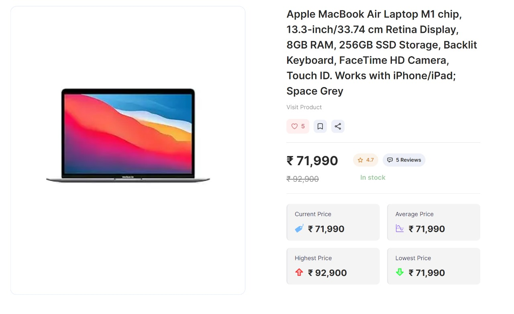

<!-- This is a [Next.js](https://nextjs.org/) project bootstrapped with [`create-next-app`](https://github.com/vercel/next.js/tree/canary/packages/create-next-app).

## Getting Started

First, run the development server:

```bash
npm run dev
# or
yarn dev
# or
pnpm dev
# or
bun dev
```

Open [http://localhost:3000](http://localhost:3000) with your browser to see the result.

You can start editing the page by modifying `app/page.tsx`. The page auto-updates as you edit the file.

This project uses [`next/font`](https://nextjs.org/docs/basic-features/font-optimization) to automatically optimize and load Inter, a custom Google Font.

## Learn More

To learn more about Next.js, take a look at the following resources:

- [Next.js Documentation](https://nextjs.org/docs) - learn about Next.js features and API.
- [Learn Next.js](https://nextjs.org/learn) - an interactive Next.js tutorial.

You can check out [the Next.js GitHub repository](https://github.com/vercel/next.js/) - your feedback and contributions are welcome!

## Deploy on Vercel

The easiest way to deploy your Next.js app is to use the [Vercel Platform](https://vercel.com/new?utm_medium=default-template&filter=next.js&utm_source=create-next-app&utm_campaign=create-next-app-readme) from the creators of Next.js.

Check out our [Next.js deployment documentation](https://nextjs.org/docs/deployment) for more details. -->


# Deal Buddy

Deal Buddy is a web application built with Next.js that allows users to input the URL of an Amazon product. The app scrapes Amazon to show the current highest, lowest, and average prices of the product. Additionally, users can opt to track the product's price, and the app will notify them when the price drops.

## Features

- **Product Price Scraping**: Input an Amazon product URL to see the current highest, lowest, and average prices.
- **Price Tracking**: Track the price of a product and receive notifications when the price drops.
- **Cron Jobs**: Automated price checking at regular intervals using cron jobs.

## Tech Stack

- **Frontend**: Next.js, Next.js, Headless UI, Tailwind CSS
- **Web Scraping**: Cheerio, Bright Data
- **Cron Jobs**: Node-cron
- **Notifications**: Nodemailer (for email notifications)
- **Database**: MongoDB

## Installation

1. **Clone the repository:**
   ```sh
   git clone https://github.com/firepixie18/Deal_buddy-Se.git
   cd my-app
2. **Install dependencies:**
    ```sh
    npm install
3. **Set up environment variables:**
    Create a `.env` file in the root directory and add the following variables:

    ### Scraper
    BRIGHT_DATA_USERNAME= \
    BRIGHT_DATA_PASSWORD=

    ### Database
    MONGODB_URI=

    ### Email
    EMAIL_PASSWORD=

4. **Run the deployment server:**
    ```sh
    npm run dev
Open http://localhost:3000 with your browser to see the result.

## Usage

1. **Enter the Amazon product URL:**
   On the home page, paste the URL of the Amazon product you want to track.

2. **View Price Information:**
   After submitting the URL, you will see the current highest, lowest, and average prices of the product.

3. **Track the Product:**
   Click on the "Track" button to start tracking the product's price. You will be notified via email when the price drops.


## Demo

Here are some screenshots of the application in action:


*Figure 1: Landing Page with search functionality.*


*Figure 2: Product price information display.*
